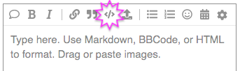
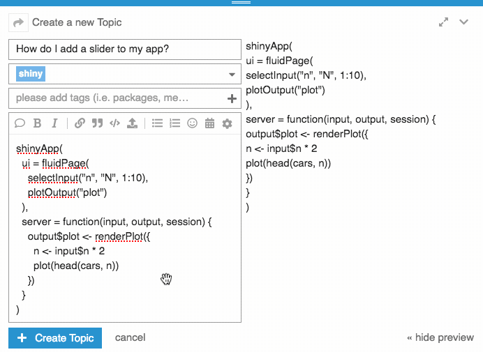
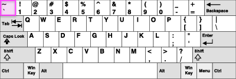

# Formatting Code: the Basics

All code or console output you include in your posts **should be formatted properly**. Luckily, this is very easy to do! Just use the **code formatting button** at the top of the post editing box:

  

1. Select some code

2. Click the <kbd></></kbd> button!

The code formatting button automatically adds special [Markdown](https://commonmark.org/help/) formatting symbols to whatever you selected. If you check the preview pane to the right of your post, you'll see that the forum software now outputs nicely formatted code :sparkles::grinning:. 

 

The code formatting button is pretty smart! It can tell the difference between snippets of code that are part of a sentence and blocks of code that stand alone. Sometimes the software will even detect that you are pasting in code and add the formatting symbols automatically! :mage:


<h2 id='heading--screenshot'>Why should I format code and console output?</h2>

There are plenty of good reasons to learn how to properly format your code!

1. [Keeping things tidy](https://community.rstudio.com/faq#keep-tidy) is one of our core community principles :sweep:
2. Unformatted code is difficult for other people to read :dizzy_face:
	- Leaving your code unformatted makes it less likely you'll get replies :disappointed:.
	- Continuing to post unformatted code after someone has asked you to fix it often comes across as rude :flushed:.
3. Console output often contains characters that the forum software interprets as special formatting symbols (e.g., `#`, `$` or `<` and `>`). This can cause parts of the text to become unrecognizable, or even to disappear completely! :anguished: Marking console output as code keeps it safe from confusing accidental formatting.

## Can't I just post a screenshot?

Please **don't post screenshots of code**. Screenshots of code are *even worse* than unformatted code :confounded:. Here's why:

- Screenshots are often difficult to read (and useless to anybody using a screen reader).
- Helpers usually want to try to *run* your code, not just read it. Screenshots force your helpers to type everything back in by hand :weary:. That's a lot to ask and many people won't bother.
- Screenshots aren't searchable, so they don't help others with similar problems find your post later on.

# Formatting Code: Beyond the Basics

- [Format R Markdown source](#heading--rmarkdown)
- [What is a backtick?](#heading--backtick)
- [Format code by hand](#heading--byhand)

<h2 id='heading--rmarkdown'>How do I format R Markdown source?</h2>

Use **four** backticks and the "markdown" syntax hint to surround the source of R Markdown documents:

<table>
<thead>
<th>Type this:</th>
<th>See this:</th>
</thead>
<tbody>
<tr>
<td>
<pre>

`````markdown
````markdown
---
title: "It's full of cars!"
output: html_document
---

```{r setup, include=FALSE}
knitr::opts_chunk$set(echo = TRUE)
```

## R Markdown

This is an R Markdown document. 
Markdown is a simple formatting 
syntax for authoring HTML, PDF, 
and MS Word documents.

```{r cars}
summary(cars)
```
````
`````

</pre>
</td>
<td>
<pre>

````markdown
---
title: "It's full of cars!"
output: html_document
---

```{r setup, include=FALSE}
knitr::opts_chunk$set(echo = TRUE)
```

## R Markdown

This is an R Markdown document. 
Markdown is a simple formatting 
syntax for authoring HTML, PDF,
and MS Word documents. 

```{r cars}
summary(cars)
```
````

</pre>
</td>
</tr>
</tbody>
</table>

<h2 id='heading--backtick'>What is this "backtick" symbol?</h2>

The [backtick](https://en.wikipedia.org/wiki/Grave_accent#Use_in_programming) symbol looks like this:

<big><kbd><b>`</b></kbd></big>

It is **not the same thing as a single quote**. It is technically the [grave accent symbol](https://en.wikipedia.org/wiki/Grave_accent#Use_in_programming), but used alone and **not combined with any letter**.

On QWERTY keyboards, the backtick is found on the same key as the tilde (~), immediately to the left of the <kbd>1</kbd> key:

 

<small>[Adapted from: Denelson83, CC BY-SA 3.0](https://commons.wikimedia.org/w/index.php?curid=508928)</small>

### My keyboard doesn't have a backtick!

The backtick is not available on [some keyboard layouts](https://superuser.com/questions/667622/), and [can be hard to find on others](https://superuser.com/a/254077). 

In these cases, the easiest thing to do is probably to use the code formatting buttons instead of typing backticks manually. However, you can also click the code formatting button **without anything selected** to insert backticks into the post editing box. Then copy and paste those backticks wherever you need them!

<h2 id='heading--byhand'>What are all the ways I can format code by hand?</h2>

Code can be formatted by hand in several ways:

- Use any of the [CommonMark markdown code formatting styles](https://commonmark.org/help/): indented code blocks, fenced code blocks, and single-backtick inline code. 
  
    For fenced code blocks, you can supply syntax highlighting hints, similar to [Github-flavored Markdown](https://guides.github.com/features/mastering-markdown/#GitHub-flavored-markdown). If you don't supply a hint, the highlighter will guess. The hint for R code is ` ```r` , but on this site the highlighter will usually identify R code correctly without a hint.

- Use [BBCode](http://bbcode.org/reference.php) syntax: `[code]` and `[/code]`
- Use [HTML](https://developer.mozilla.org/en-US/docs/Web/HTML/Element/code#Notes): `<code></code>` for inline code, and `<pre><code></code></pre>` for blocks of code.

<table>
<thead>
<th>Type this:</th>
<th>See this:</th>
</thead>
<tbody>
<tr>
<td>
<pre>
```javascript
var body = d3.select("body");
var div = body.append("div");
div.html("Hello, world!");
```
</pre>
</td>
<td>
<pre><code>var body = d3.select("body");
var div = body.append("div");
div.html("Hello, world!");
</code></pre>
</td>
</tr> 
<tr>
<td>
<pre>
[code]
var body = d3.select("body");
var div = body.append("div");
div.html("Hello, world!");
[/code]
</pre>
</td>
<td>
<pre><code>var body = d3.select("body");
var div = body.append("div");
div.html("Hello, world!");
</code></pre>
</td>
</tr>
<tr>
<td>
<pre>
&lt;pre&gt;&lt;code&gt;
var body = d3.select("body");
var div = body.append("div");
div.html("Hello, world!");
&lt;/code&gt;&lt;/pre&gt;
</pre>
</td>
<td>
<pre><code>var body = d3.select("body");
var div = body.append("div");
div.html("Hello, world!");
</code></pre>
</td>
</tr> 
</tbody>                                       
</table>
