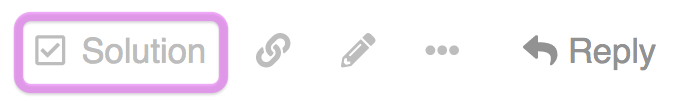
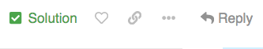
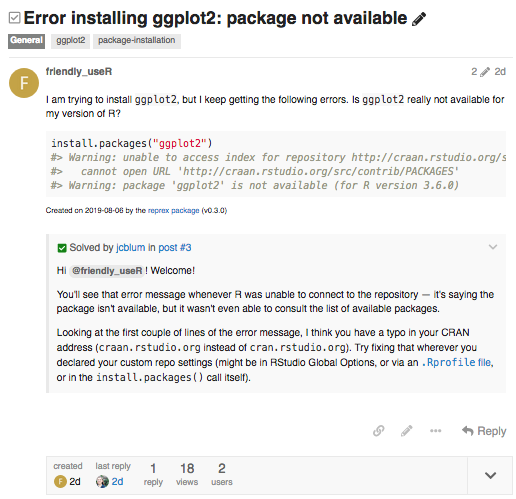

If your question has been answered, don't forget to mark the solution!

## How do I mark a solution?

Find the reply you want to mark as the solution and look for the row of small gray icons at the bottom of that reply. Click the one that looks like a box with a checkmark in it: 

 

Hovering over the mark solution button shows the label, "Select if this reply solves the problem". If you don't see the mark solution button, try clicking the three dots button ( ••• ) to expand the full set of options.

When a solution is chosen, the icon turns green and the hover label changes to: "Unselect if this reply no longer solves the problem". Success! :trophy:

 

:information_source: Marking a solution **sends a notification** to the person who wrote the reply you marked. The reply you marked will also be displayed as a quote at the bottom of your original post:

 

## Why mark a solution?

- People with a similar question can quickly see what worked for you. :heavy_check_mark:
- Helpers can find topics that still need help more easily. :female_detective:
- Solutions don't earn anybody points here, but acknowledging the person who solved your problem is friendly and will make them feel good! :heart:

## Who can mark a solution?

You can mark a solution if:

- You are the person who originally created the topic
- The category you posted in has solution marking turned on (a few don't)

[Moderators and staff members](https://community.rstudio.com/about) can also mark solutions in topics they did not create.

## Can I change my mind?

Yes! :grinning:

To mark a different reply as the solution, just repeat the process above for that reply. There's no need to un-mark the existing solution first — marking a new solution will take care of that automatically.

If you want to un-mark the chosen reply without marking another one, click the green "Solution" icon (hover label: "Unselect if this reply no longer solves the problem").
