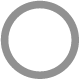
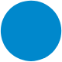
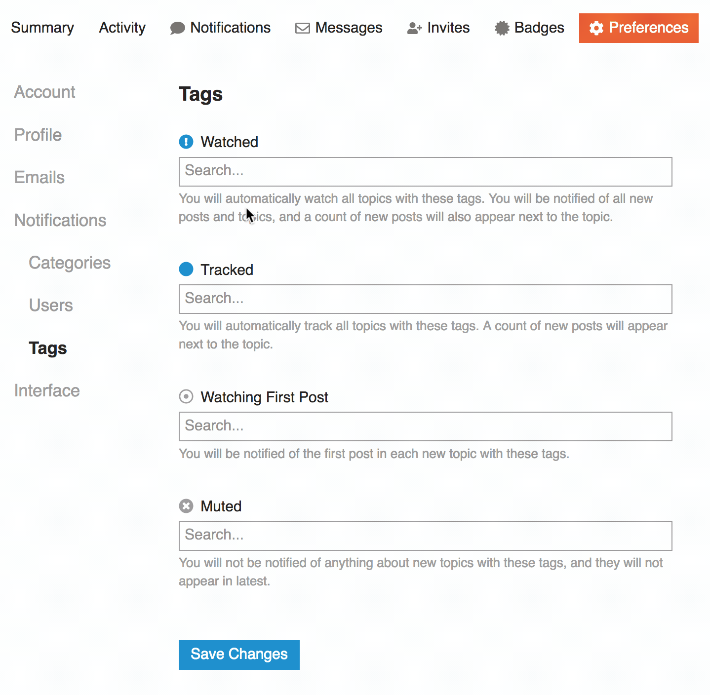
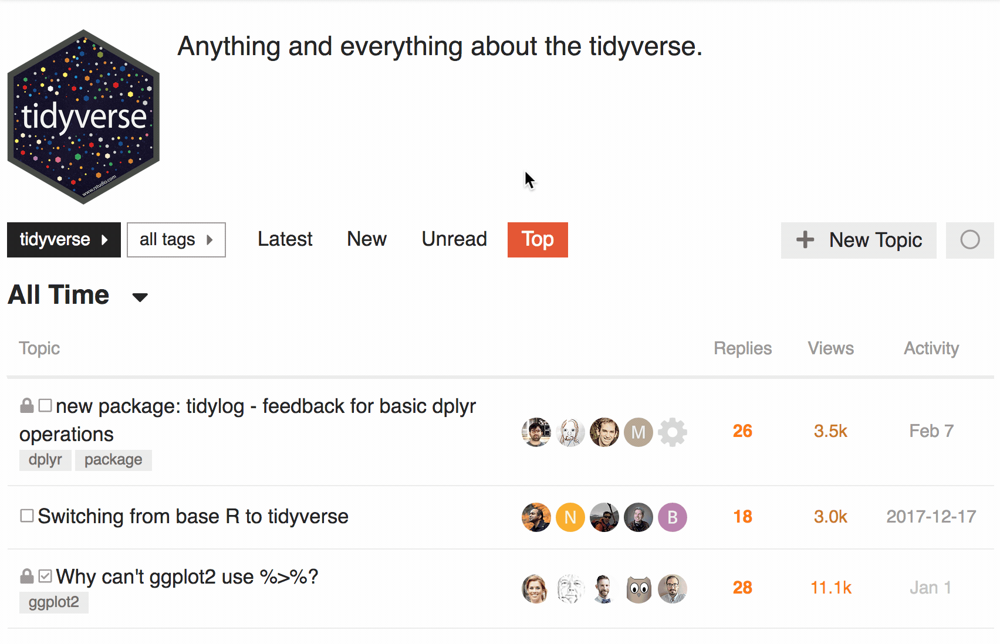
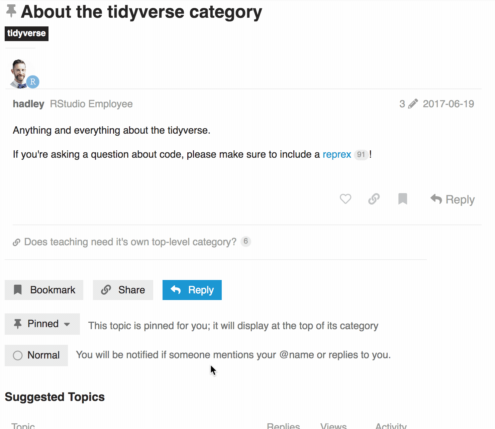

There's a lot of activity on community.rstudio.com. New conversations and replies come in fast and cover a broad range of subjects. It can be hard to zero in on the posts you're most interested in! :dizzy_face: 

Here are some tools that can help! :grinning: :relieved:

- :bell: [Subscribe to categories and tags](#heading--subscribe-cat-tag) so you always get notified about what's new

- :control_knobs: [Adjust the notification level](#heading--adjust-by-topic) for specific conversations

#### A note about notification levels

The notification system on this site uses five notification levels. They're used in several different places to control how the site works for you, so it's helpful to know what they mean.

<table>
<thead>
<tr>
<th>Icon</th>
<th>Name</th>
<th>What it means</th>
</tr>
</thead>
<tbody>
<tr>
<td>

</td>
<td>

**Normal / Regular**

</td>
<td>

The default for all categories and tags, and for topics you did not create and haven't read or replied to. You'll only get notified if someone mentions you directly, or replies to something you posted.</td>
</tr>
<tr>
<td>

</td>
<td>

**Tracking**

</td>
<td>

Like Normal mode, *plus* a count of new replies will be shown for a tracked topic (and a count of new topics will be shown for a tracked category or tag).
</td>
</tr>
<tr>
<td>

</td>
<td>

**Watching**

</td>
<td>

The _notify me as much as possible_ setting. Like Tracking mode, _plus_ you'll receive a notification for every new reply in a watched topic (and for every new topic in a watched category or tag). If you aren't active on the site, these notifications will be sent as email messages.

</td>
</tr>
<tr>
<td>

</td>
<td>

**Watching First Post**

</td>
<td>

A middle ground between Tracking and Watching, available for categories and tags. You'll only get notified of new topics in a category or tag, but not further replies.

</td>
</tr>
<tr>
<td>

</td>
<td>

**Muted**

</td>
<td>

The _pretend this doesn't exist_ setting. 
   - You won't ever be notified about anything with these topics, categories, or tags. 
   - Topics in muted categories or tags won't show up in your "Latest" view. 
   - Muted categories also won't show up on the main [Categories](https://community.rstudio.com/categories) page (but they may still show up in the hamburger menu)

</td>
</tr>
</tbody>
</table>

<h2 id="heading--subscribe-cat-tag"> Subscribe to categories and tags</h2>

You can do this all at once from your user preferences, or as you go along from category or tag pages.

### Add subscriptions from your user preferences

1. Go to the **Categories** or **Tags** section of your notification preferences:
    - `https://community.rstudio.com/u/`[u] _username_ [/u]`/preferences/categories`
    - `https://community.rstudio.com/u/`[u] _username_ [/u]`/preferences/tags`

2. Add tags or categories into the boxes corresponding to the notification levels you want, and click **Save Changes**.

For example, this user is subscribing to **Watch** threads tagged with `tidyeval`. 

 

### Add subscriptions from a category or tag page

When you're viewing the main page for either a category or tag, look for the notification level button above the list of posts, at the upper right. 
- It will look like the icon for the currently set notification level for that category or tag, and show the name of that level when you hover over it.
- Click on the notification level button to change your settings for the category or tag you are viewing.

For example, this user is subscribing to **Watch** the [tidyverse](https://community.rstudio.com/c/tidyverse/) category (starting with the default setting, *Normal*):

<h2 id="heading--adjust-by-topic"> Adjust the notification level for specific conversations</h2>

You can change the notification level on a conversation-by-conversation basis. This can be helpful if you want to make sure you don't miss anything (set the topic's notification level to **Watching**) or if you want to stop getting notifications about a conversation (set the topic to **Muted**).

Look for the notification level button at the very bottom of the topic. 
- It will look like the name and icon of the currently set notification level for the topic, and show the name of that level when you hover over it.
- Click on the notification level button to change your settings for the topic you are viewing.

For example, this user is muting notifications for a topic:

